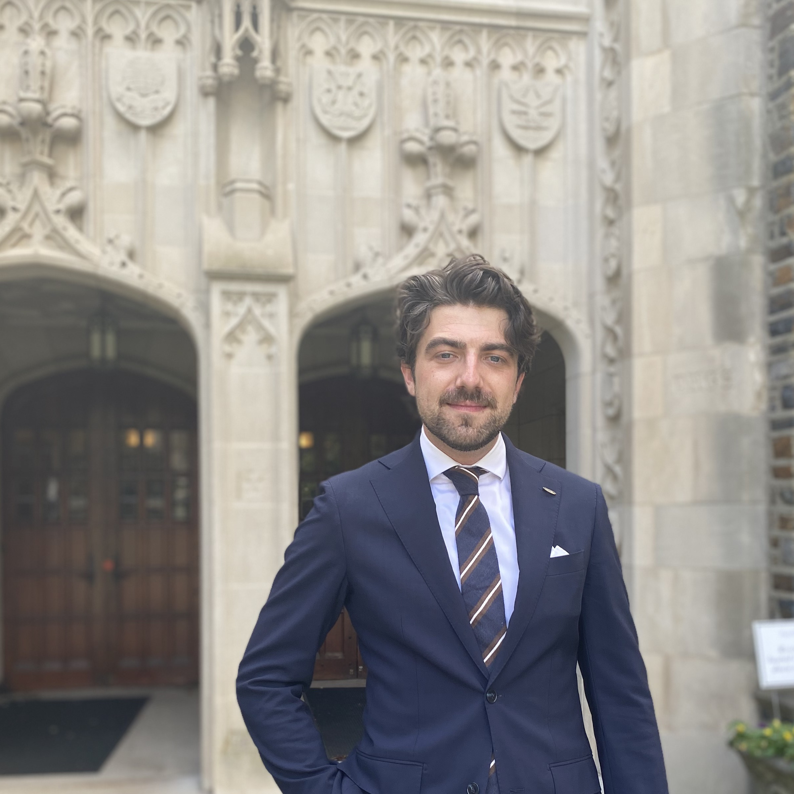

  
  

    
Hi there! I'm a fifth-year PhD Candidate in Social and Political Science at Bocconi University in Milan. I'm currently working remotely from Rotterdam, the Netherlands. 

    
 My research focuses on political behavior, public opinion, and legislative politics in Western liberal democracies. In my dissertation I study the consequences of far-right success. For example: I study whether this leads to more hate crimes or how it affects day-to-day work in parliament. My research has been published in the <em>British Journal of Political Science</em>.

    
During my PhD I was a visiting doctoral student at Princeton University and the London School of Economics. Before starting my doctoral studies, I completed master’s degrees at Duke University (as a Fulbright scholar) and Erasmus University Rotterdam.

  

