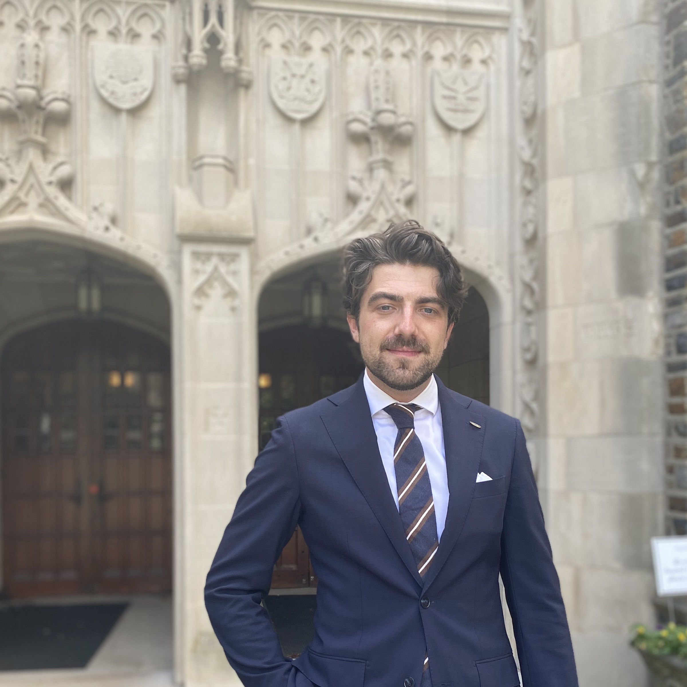

  

    
    
Dirck de Kleer

  

  

    
Hi there! I'm a PhD Candidate in Social and Political Science at Bocconi University in Milan. I'm currently working remotely from Rotterdam, the Netherlands. 

    
 My research focuses on political behavior, public opinion, and legislative politics in Western liberal democracies. In my dissertation I study the consequences of far-right success. For example: I study whether this leads to more hate crimes or how it affects day-to-day work in parliament. My research has been published in the <em>British Journal of Political Science</em>.

  

